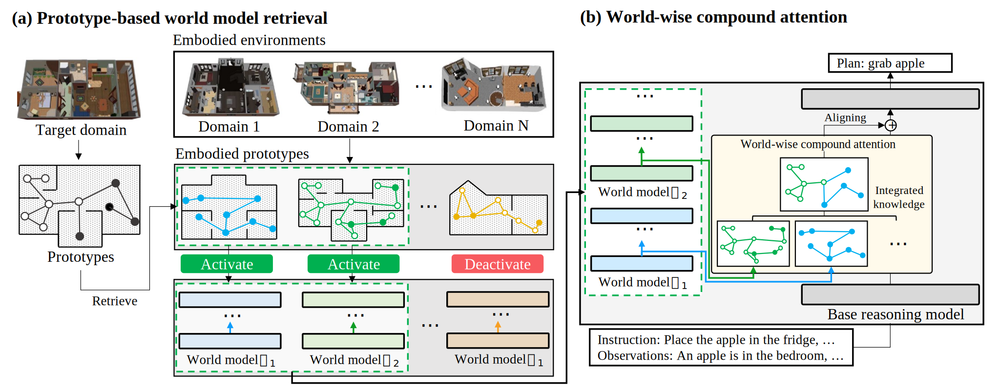

# World Model Implanting for Test-time Adaptation of Embodied Agents (ICML 2025)



WorMI implants one or more frozen world-model CausalLMs into a frozen base
CausalLM through trainable cross-attention adapters. This fork keeps the core
model code and adds reproducible data builders, runnable curricula, and helper
scripts for the VirtualHome and ALFWorld reproduction work.

## What This Fork Adds

- `tools/build_virtualhome_dataset.py`: builds paper-style VirtualHome JSONL data from the official static program release.
- `tools/build_alfworld_dataset.py`: builds ALFWorld textual-env JSONL data from official game files.
- `tools/world_curricula_vh.py` and `tools/wormi_curricula_vh.py`: VirtualHome stage-1 world-model training and stage-2 WorMI adapter training curricula.
- `tools/world_curricula_alfworld.py` and `tools/wormi_curricula_alfworld.py`: ALFWorld task-split curricula.
- `wormi eval-table1`: offline Table-1-style JSONL evaluation.
- `wormi eval-vh-rollout`: VirtualHome rollout evaluation with EvolvingGraph.
- `sh/`: unattended rebuild/train/eval wrappers with cache and checkpoint paths kept off the repo filesystem.

Large generated data, checkpoints, logs, and model weights are not committed to
Git. Use GitHub Releases, Google Drive, or a shared filesystem for those files.

## Environment

Python 3.12+ is required. This project uses `uv` and pinned ML dependencies in
`pyproject.toml`; do not casually upgrade `transformers` or `trl`, because the
model and trainer code call version-specific internals.

```bash
uv sync
uv run wormi --help
```

On a cluster or GPU server, run `uv sync` on a compute node. It downloads heavy
PyTorch and Transformers wheels. Put caches and temporary files on a large disk:

```bash
export DATA_DISK=/root/autodl-tmp
export WORMI_DATA_DISK=$DATA_DISK
export UV_CACHE_DIR=$DATA_DISK/uv-cache
export HF_HOME=$DATA_DISK/hf-home
export TMPDIR=$DATA_DISK/tmp
mkdir -p "$UV_CACHE_DIR" "$HF_HOME" "$TMPDIR"
```

The provided curricula default to the unrestricted `unsloth/Llama-3.2-*` model
mirrors. If you switch back to `meta-llama/*`, make sure the environment has a
valid Hugging Face token and accepted model licenses.

## Ready-To-Use Processed Data

The processed JSONL data for this fork is published as a GitHub Release asset:

- Release: https://github.com/yangziyu-620/wormi-re/releases/tag/data-2026-05-25
- Asset: `wormi-jsonl-data-2026-05-25.tar.gz`
- SHA256: `5b0e4fa36e8f479e0580f0c8ba66cc6c60db01e917c586cc69a346ba82c6e061`

Download and extract it into the data root expected by the scripts:

```bash
export DATA_DISK=/root/autodl-tmp
mkdir -p "$DATA_DISK/wormi-data" /tmp/wormi-release

gh release download data-2026-05-25 \
  --repo yangziyu-620/wormi-re \
  --pattern 'wormi-jsonl-data-2026-05-25.tar.gz' \
  --dir /tmp/wormi-release

sha256sum /tmp/wormi-release/wormi-jsonl-data-2026-05-25.tar.gz

tar -xzf /tmp/wormi-release/wormi-jsonl-data-2026-05-25.tar.gz \
  -C "$DATA_DISK/wormi-data"
```

After extraction the layout is:

```text
$DATA_DISK/wormi-data/
|-- virtualhome/
|   |-- scene_0..scene_5/train.jsonl
|   |-- test_seen_task_seen_scene.jsonl
|   |-- test_seen_task_unseen_scene.jsonl
|   |-- test_unseen_task_seen_scene.jsonl
|   |-- test_unseen_task_unseen_scene.jsonl
|   `-- virtualhome_manifest.json
|-- alfworld/
|   |-- task_pick_simple/train.jsonl
|   |-- task_look_at_obj/train.jsonl
|   |-- task_pick_heat/train.jsonl
|   |-- task_pick_cool/train.jsonl
|   |-- task_pick_two/train.jsonl
|   |-- task_pick_clean/train.jsonl
|   |-- test_seen_task_seen_scene.jsonl
|   |-- test_seen_task_unseen_scene.jsonl
|   |-- test_unseen_task_seen_scene.jsonl
|   `-- test_unseen_task_unseen_scene.jsonl
`-- scene-inits/
    |-- init_graphs_20_semantic.json
    `-- init_graphs_20_semantic_manifest.json
```

`share/` is only a local staging directory and is ignored by Git. Older
local staging packages, such as the room-based ALFWorld snapshot, are not the
recommended starting point; the release asset above is aligned with this fork's
current training curricula.

## Rebuild Data From Raw Sources

Full details and troubleshooting are in `tools/REPRODUCE_DATA.md`. The short
paths are below.

### VirtualHome

The wrapper downloads the official static program zip when missing, clones the
VirtualHome source tree for EvolvingGraph, builds a 20-scene init cache, and
writes JSONL splits under `$DATA_DISK/wormi-data/virtualhome`.

```bash
export DATA_DISK=/root/autodl-tmp
uv sync
bash sh/wormi-build-vh-data.sh
```

Important outputs:

- `scene_0..scene_5/train.jsonl`: six seen-scene stage-1 world-model datasets.
- `test_seen_task_seen_scene.jsonl`: Table 1 column 1 style evaluation.
- `test_seen_task_unseen_scene.jsonl`: Table 1 column 2 style evaluation.
- `test_unseen_task_unseen_scene.jsonl`: Table 1 column 3 style evaluation.
- `scene-inits/init_graphs_20_semantic.json`: required by rollout evaluation.

### ALFWorld

For ALFWorld, keep the temporary venv and unzipped game files on `/tmp` or a
large local disk to avoid inode quota problems. The builder writes room/task
JSONL data, then the resplit script creates the six task-type directories used
by the ALFWorld curricula.

```bash
export DATA_DISK=/root/autodl-tmp
export ALFWORLD_DATA=/tmp/alfworld-data

python3 -m venv /tmp/alfworld-venv
/tmp/alfworld-venv/bin/pip install -U pip wheel
/tmp/alfworld-venv/bin/pip install alfworld
/tmp/alfworld-venv/bin/pip install torch --no-deps --index-url https://download.pytorch.org/whl/cpu

# Put official ALFWorld json_2.1.1_json.zip and json_2.1.2_tw-pddl.zip under
# $DATA_DISK/wormi-data/alfworld-data-zips, unzip them into $ALFWORLD_DATA,
# then run:
/tmp/alfworld-venv/bin/python tools/build_alfworld_dataset.py \
  --alfworld-data "$ALFWORLD_DATA" \
  --output-dir "$DATA_DISK/wormi-data/alfworld-room-split"

python3 tools/resplit_alfworld_by_task_type.py \
  --src-root "$DATA_DISK/wormi-data/alfworld-room-split" \
  --dst-root "$DATA_DISK/wormi-data/alfworld"
```

Use `tools/REPRODUCE_DATA.md` for the exact download commands, smoke tests, and
known ALFWorld textual-env issues.

## Train VirtualHome

Stage 1 trains six frozen world models, one per seen scene:

```bash
export DATA_DISK=/root/autodl-tmp
bash sh/wormi-train-vh-world.sh
```

Expected checkpoints:

```text
$DATA_DISK/wormi-checkpoints/world-vh/scene_0/last
...
$DATA_DISK/wormi-checkpoints/world-vh/scene_5/last
```

Stage 2 trains the WorMI cross-attention adapters with `K=3` retrieval over the
six world models:

```bash
export DATA_DISK=/root/autodl-tmp
bash sh/wormi-train-vh-wormi.sh
```

Expected checkpoint:

```text
$DATA_DISK/wormi-checkpoints/wormi-vh/wormi-vh-n6/last
```

Useful overrides:

```bash
WORMI_WORLD_VH_BATCH_SIZE=1 bash sh/wormi-train-vh-world.sh
WORMI_VH_STAGE2_BATCH_SIZE=1 WORMI_VH_STAGE2_GRADIENT_ACCUMULATION_STEPS=4 \
  bash sh/wormi-train-vh-wormi.sh
```

## Evaluate VirtualHome

Offline Table-1-style JSONL evaluation:

```bash
export DATA_DISK=/root/autodl-tmp
bash sh/wormi-eval-vh-table1.sh
```

Rollout evaluation through EvolvingGraph:

```bash
export DATA_DISK=/root/autodl-tmp
bash sh/wormi-eval-vh-rollout.sh
```

Outputs are written under:

```text
$DATA_DISK/wormi-checkpoints/wormi-vh/wormi-vh-n6/table1
$DATA_DISK/wormi-checkpoints/wormi-vh/wormi-vh-n6/vh-rollout
```

## Train And Evaluate ALFWorld

The ALFWorld curricula now read paths from environment variables and default to
`$WORMI_DATA_DISK/wormi-data/alfworld` and
`$WORMI_DATA_DISK/wormi-checkpoints/*`.

```bash
export WORMI_DATA_DISK=/root/autodl-tmp
uv run wormi world train --curricula_path tools/world_curricula_alfworld.py
uv run wormi train --curricula_path tools/wormi_curricula_alfworld.py
```

Evaluate the trained adapter:

```bash
export WORMI_DATA_DISK=/root/autodl-tmp
uv run wormi eval-table1 \
  --curricula_path tools/wormi_curricula_alfworld.py \
  --model_name "$WORMI_DATA_DISK/wormi-checkpoints/wormi-alfworld/wormi-alfworld-n6/last" \
  --output_path "$WORMI_DATA_DISK/wormi-checkpoints/wormi-alfworld/wormi-alfworld-n6/table1"
```

Path overrides:

```bash
export WORMI_ALFWORLD_DATA_ROOT=/path/to/alfworld
export WORMI_WORLD_ALFWORLD_OUTPUT_DIR=/path/to/world-alfworld
export WORMI_ALFWORLD_OUTPUT_DIR=/path/to/wormi-alfworld
```

## CLI Reference

```bash
uv run wormi --help
uv run wormi world train --curricula_path tools/world_curricula_vh.py
uv run wormi world eval --model-name MODEL --dataset-path DATASET_DIR --output-path OUT
uv run wormi train --curricula_path tools/wormi_curricula_vh.py
uv run wormi eval --curricula_path tools/wormi_curricula_vh.py --model_name MODEL
uv run wormi eval-table1 --curricula_path tools/wormi_curricula_vh.py --model_name MODEL --output_path OUT
uv run wormi eval-vh-rollout --curricula_path tools/wormi_curricula_vh.py --model_name MODEL --output_path OUT
```

Curricula files are Python files, not JSON/YAML. Each one must define a top-level
`curricula` variable of the expected type.

## Notes

- `requirements.txt` was removed; use `uv.lock` and `pyproject.toml`.
- Keep generated data/checkpoints/logs out of Git. Use releases or shared storage.
- The model code saves with `safe_serialization=False` because the world-model weight sharing trips safetensors.
- The trainer uses a Llama-3 chat template and `DataCollatorForCompletionOnlyLM`; datasets must be converted through the repo's `as_chat(...)` path.
